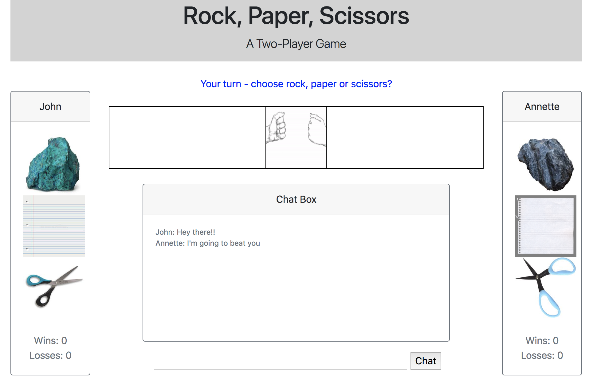
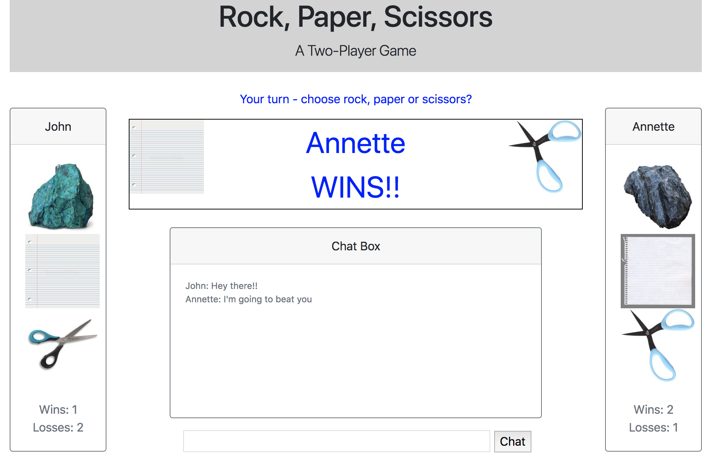

# RPS

This is a real-time, multi-player Rock, Paper, Scissors Game.

## Description 

Users will input their name to enter the game.  They then pick either rock, paper or scissors and play against another player in real-time.

### Usage instructions

User input their name and waits for another player to join.  Once the other player joins, each one is prompted place their selection by clicking on one of the images (rock, paper or scissors).  Once both players have selected their choices, the application will reveal a winner and restart a new game.

While playing, the users can use the chat box to chat to each other online.  The chat is not enabled unless a game is in progress (requiring two players).